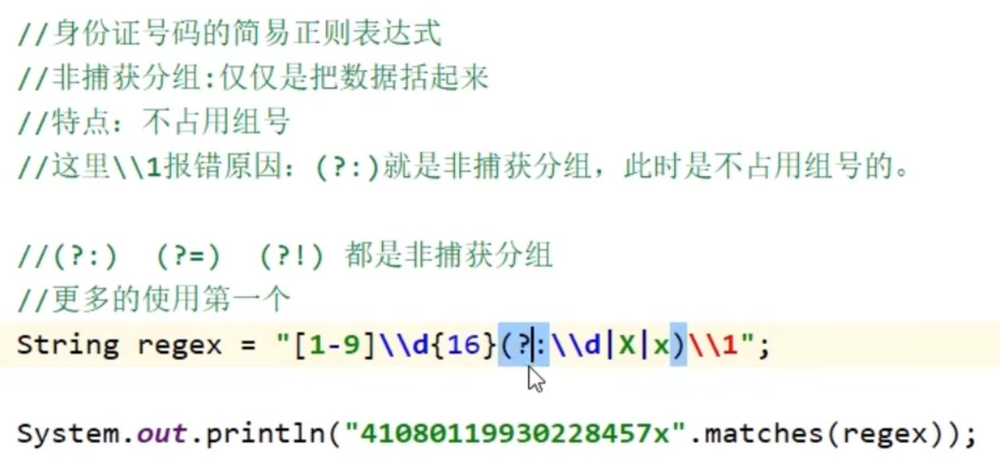

# 正则表达式 

具体语法去看

[正则表达式](https://blog.csdn.net/qq28129019/article/details/115913596?ops_request_misc=%257B%2522request%255Fid%2522%253A%2522168412923316800215052926%2522%252C%2522scm%2522%253A%252220140713.130102334..%2522%257D&request_id=168412923316800215052926&biz_id=0&utm_medium=distribute.pc_search_result.none-task-blog-2~all~top_positive~default-1-115913596-null-null.142^v87^control,239^v2^insert_chatgpt&utm_term=%E6%AD%A3%E5%88%99%E8%A1%A8%E8%BE%BE%E5%BC%8F%E8%AF%AD%E6%B3%95&spm=1018.2226.3001.4187)


​	

+ 心得：拿到一个数据，从左到右写


+ 使用字符串的matches方法来进行正则表达式校验
+ 在正则表达式中若使用具体的数字便是表示这个位置只能是这个字符。

``` java
   //在正则表达式中使用 {}来表示前面的东西能出现几次
        String regex1="1[3-9]\\d{9}";//验证手机号码
        String a="13345678912";
        System.out.println("13345678912".matches(regex1));
        System.out.println(a.matches(regex1));
```


### 逻辑判断

+ 正则表达式中 可以用 | & 之类的符号

```java
  public static void main(String[] args) {
        String a="[0-1]|[4-6]";
        System.out.println("5".matches(a));
    }//输出结果式true
```

### 小括号


+ 由于字符匹配的规则相同，所以可以使用括号括起来，使得这个相同的规则重复


+ 使用括号防止|、& 等逻辑符号造成的误解


#### 关于小括号的组号


##### 捕获分组（小括号的应用）


##### 非捕获分组





## ?的作用 


## 扩展使用


+ 使用正则表达式来获取一段文字中符合要求的一部分。


## 贪婪爬取与非贪婪爬取


	


## 字符串匹配


## 爬虫


