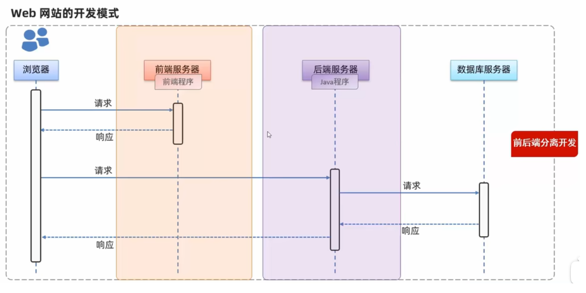
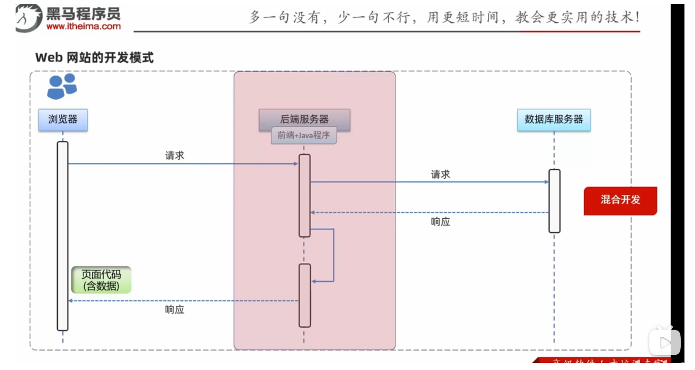
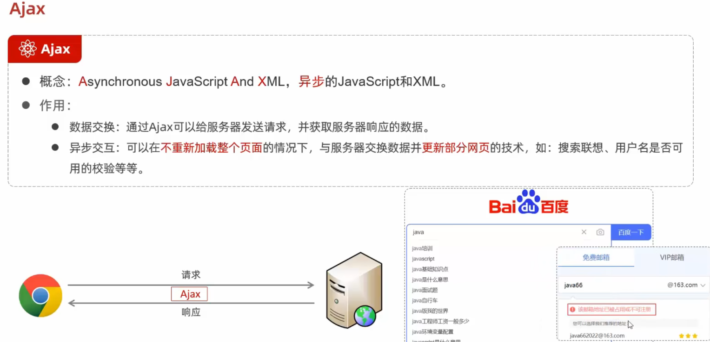
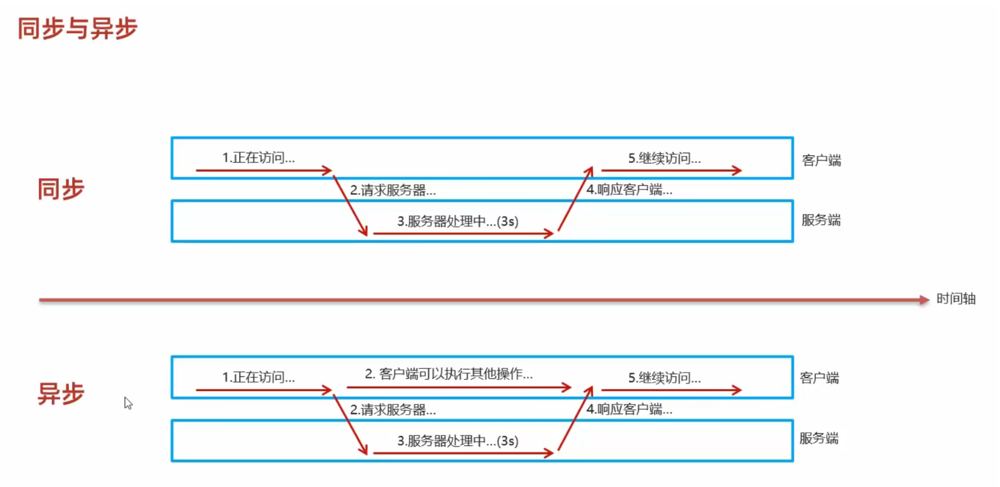
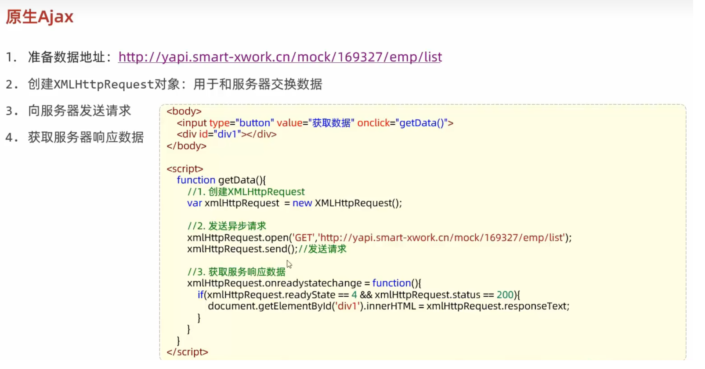
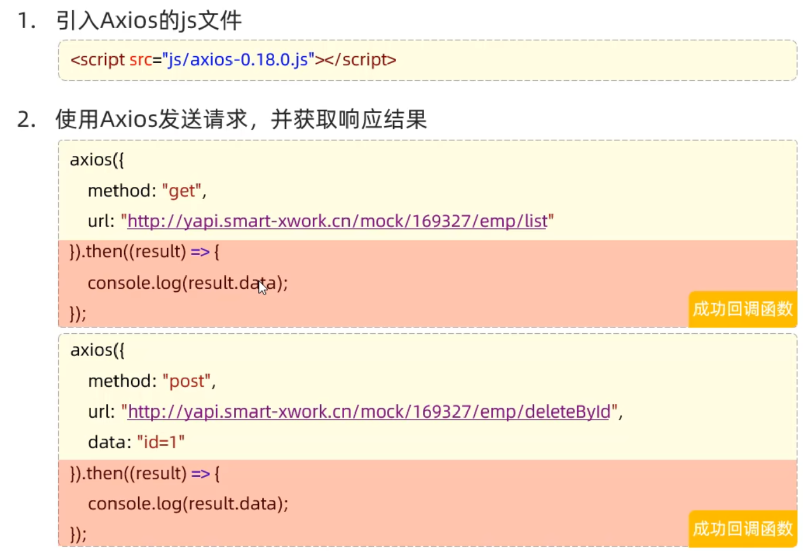
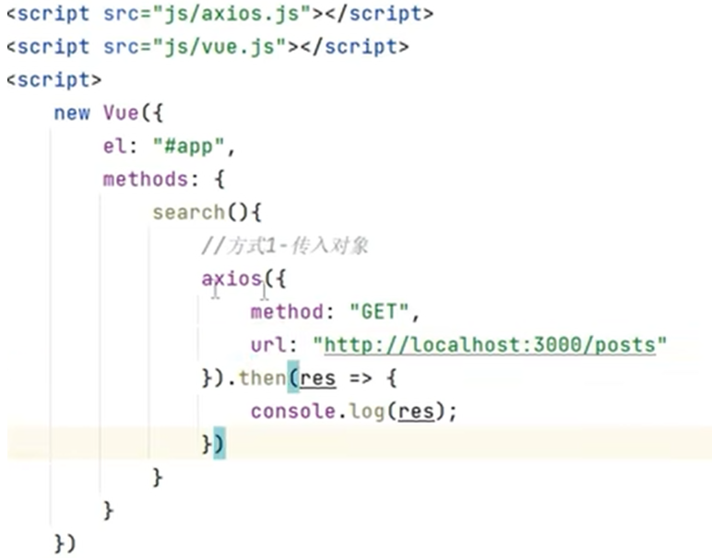

# JavaWeb

## 开发Web网站的方式

### 前后端分离开发



### 混合开发模式



## ajax

### 什么是ajax

+ ajax即 **异步JavaScript和XML**（异步交互技术（异步通信技术）），可以在不更新所有网页的情况下，更新部分网页。



### 同步与异步



+ 一个网页还没加载出来时，导航栏下面是空白，这个时候点击空白处没有任何反应，这就是同步技术


### 操作ajax



## axios



### 使用方法一



### 使用方法2

```js
<!DOCTYPE html>
<html lang="en">

<head>
    <meta charset="UTF-8">
    <title>Title</title>
    <script src="js/axios.js"></script>
    <script src="js/vue.js"></script>
</head>

<body>
    <div id="app">
        <button @click="search">查询新闻信息</button>
    </div>
    <script>
        new Vue({
            el: "#app",
            methods: {
                search() {
                    axios.get("http://localhost:3000/posts")
                        .then(res => {//通过回调函数（参数函数）then来处理请求成功
                            console.log(res.data);
                        })
                }
            }
        });
    </script>
</body>

</html>
```

```js
<!DOCTYPE html>
<html lang="en">

<head>
    <meta charset="UTF-8">
    <title>Title</title>
</head>

<body>
    <div id="app">
        <button @click="search">查询新闻信息</button>
    </div>

    <!-- 官网提供的 axios 在线地址 -->
    <!--<script src="https://unpkg.com/axios/dist/axios.min.js"></script>-->
    <script src="js/axios.js"></script>
    <script src="js/vue.js"></script>
    <script>
        new Vue({
            el: "#app",
            methods: {
                search() {
                    axios.get("http://localhost:3000/posts1")
                        .then(res => {
                            console.log(res.data);
                        }).catch(console.log("异常"))//也是一个回调函数
                }
            }
        });
    </script>
</body>

</html>
```

### 默认配置

``` js
<!DOCTYPE html>
<html lang="en">
<head>
    <meta charset="UTF-8">
    <title>Title</title>
</head>
<body>
<div id="app">
    <button @click="search">查询新闻信息</button>
    <ul>
        <li v-for="item in postList" :key="item.id">
            {{item.id}} {{item.title}} {{item.author}}
        </li>
    </ul>
</div>
<script src="js/axios.js"></script>
<script src="js/vue.js"></script>
<script>
    axios.defaults.baseURL="http://localhost:3000"//(这样就设置默认。提出url共同部分)
    new Vue({
        el: "#app",
        data:{
          postList:[]
        },
        methods: {
            search() {
                axios.get("/posts")
                    .then(
                        res => {
                            console.log(res);
                            this.postList = res.data;
                        }
                    ).catch(console.log("异常"))
            }
        }
    })
</script>
</body>
</html>
```

### 实现新增功能

``` js
<!DOCTYPE html>
<html lang="en">

<head>
    <meta charset="UTF-8">
    <title>Title</title>
</head>

<body>
    <div id="app">
        <button @click="search">查询新闻信息</button>
        <ul>
            <li v-for="item in postList" :key="item.id">
                {{item.id}} {{item.title}} {{item.author}}
            </li>
        </ul>
        <div>
            新闻标题：<input value="" v-model="title">
            作者：<input value="" v-model="author">
            <button @click="add">新增新闻</button>
        </div>
    </div>

    <script src="js/axios.js"></script>
    <script src="js/vue.js"></script>
    <script>
        axios.defaults.baseURL = "http://localhost:3000";
        new Vue({
            el: "#app",
            data: {
                postList: [],
                title: "",//将该属性绑定到相应框中
                author: ""
            },
            methods: {
                search() {
                    // 异常处理方式-建议
                    axios.get("/posts")
                        .then(
                            res => {
                                console.log(res);
                                this.postList = res.data;
                            }
                        )
                },
                add() {
                    axios.post("/posts", {//发送post请求，新增服务器上的数据
                        title: this.title,//此处this指的是vue本身，也就是这个vue对象
                        author:this.author
                    }).then(//请求成功则打印出请求对象
                        res => {
                            console.log(res)
                        }
                    )
                    this.search()//调用上一个方法
                }

            }
        })
    </script>
</body>

</html>
```

更简便的写法如下

``` js 
<!DOCTYPE html>
<html lang="en">
<head>
    <meta charset="UTF-8">
    <title>Title</title>
</head>
<body>
<div id="app">
    <button @click="search">查询新闻信息</button>
    <ul>
        <li v-for="item in postList" :key="item.id">
            {{item.id}} {{item.title}} {{item.author}}
        </li>
    </ul>
    <div>
        新闻标题：<input v-model="postOb.title">
        作者：<input v-model="postOb.author">
        <button @click="add">新增新闻</button>
    </div>
</div>
<script src="js/axios.js"></script>
<script src="js/vue.js"></script>
<script>
    axios.defaults.baseURL = "http://localhost:3000";
    new Vue({
        el: "#app",
        data: {
            postList: [],
            postOb: {
                title: "",
                author: "",
            }
        },
        methods: {
            search() {
                // 异常处理方式-建议
                axios.get("/posts")
                    .then(
                        res => {
                            console.log(res);
                            this.postList = res.data;
                        }
                    )
            },
            add() {
                axios.post("/posts", this.postOb).then(
                    res => {
                        console.log(res);
                    }
                )
                this.search();
            },
        }
    })
</script>
</body>
</html>
```

### 实现删除功能 

``` js
<!DOCTYPE html>
<html lang="en">

<head>
    <meta charset="UTF-8">
    <title>Title</title>
</head>

<body>
    <div id="app">
        <button @click="search">查询新闻信息</button>
        <ul>
            <li v-for="item in postList" :key="item.id">
                {{item.id}} {{item.title}} {{item.author}} <button @click="remove(item.id)">删除</button>
            </li>
        </ul>
        <div>
            新闻标题：<input v-model="postOb.title">
            作者：<input v-model="postOb.author">
            <button @click="add">新增新闻</button>
        </div>
    </div>
    <script src="js/axios.js"></script>
    <script src="js/vue.js"></script>
    <script>
        axios.defaults.baseURL = "http://localhost:3000";
        new Vue({
            el: "#app",
            data: {
                postList: [],
                postOb: {
                    title: "",
                    author: "",
                }
            },
            methods: {
                search() {
                    axios.get("/posts")
                        .then(res => {
                            console.log(res);
                            this.postList = res.data;
                        })
                },
                add() {
                    axios.post("/posts", this.postOb)
                        .then(res => {
                            console.log(res);
                            this.search();
                        })
                },
                remove(id) {
                    axios.delete(`/posts/${id}`)//注意需要将id正确传输
                        .then(res => {
                            console.log(res);
                            this.search();
                        })
                        .catch(err => {
                            console.error(err);
                        });
                }
            },
            mounted() {
                this.search();
            }
        });
    </script>
</body>

</html>
```

